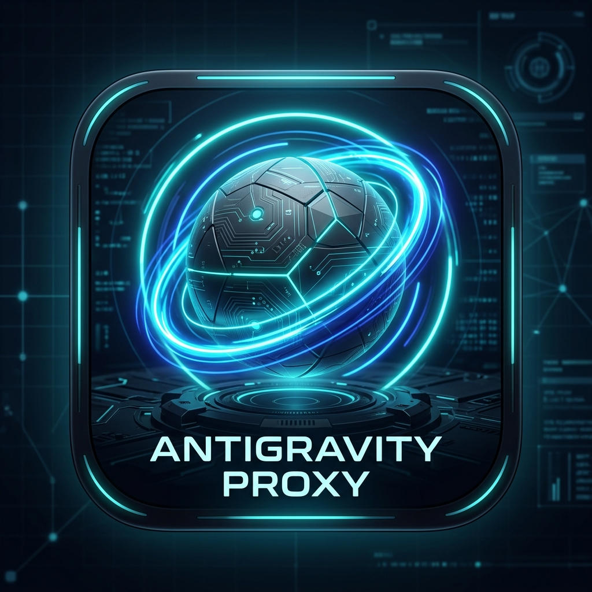
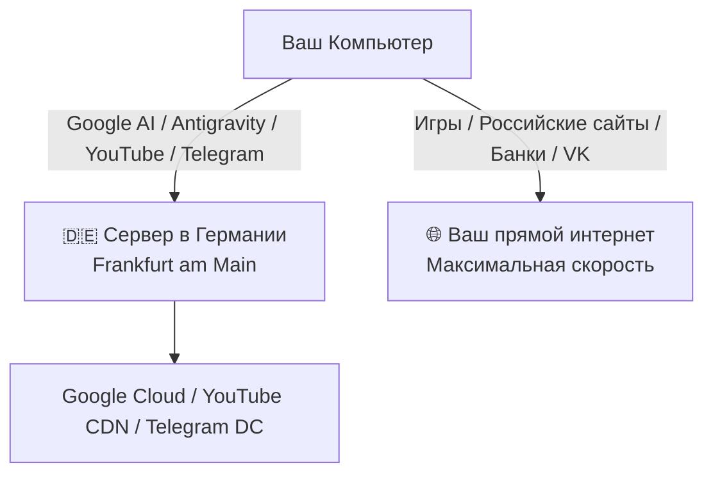

# 🇩🇪 antigravity-Proksi_Patch v1.1.0 — Germany Access Gateway

[-success?style=for-the-badge)](https://github.com/root88888tr-creator/antigravity-Proksi_Patch)

  <b>Универсальный установщик и оптимизатор окружения для Google AI, YouTube, Telegram и Antigravity с гибким выбором компонентов и технологией умной маршрутизации Split-Tunneling.</b>

[📥 **Скачать установщик (Proksi_Patch_Setup.exe)**](Proksi_Patch_Setup.exe) &nbsp;&nbsp;•&nbsp;&nbsp; [💬 **Наш Telegram-канал**](https://t.me/antigravity_proxy)

---

> [!IMPORTANT]
> **⭐ Важное примечание по работе Antigravity:**
> **antigravity-Proksi_Patch** обеспечивает сетевой шлюз (геолокацию Германия и обход региональных блокировок Google/Telegram) и автоматически исправляет системные ошибки в папке `.gemini`. Однако для доступа к продвинутым тяжелым моделям в **Antigravity (IDE / CLI)** на вашем аккаунте Google может потребоваться активная подписка **PRO** (Google One AI Premium / Gemini Advanced).

---

> [!WARNING]
> **⚠️ ВНИМАНИЕ: Проект на этапе открытого тестирования**
> Данное программное обеспечение создано в **исследовательских и ознакомительных целях** (Proof of Concept). На период активного тестирования доступ предоставляется **полностью бесплатно и без ограничений по времени**.

---

## ✨ Что нового в версии 1.1.0

* 🎛️ **Интерактивное меню компонентов:** Вы сами выбираете при установке, какие маршруты включать (Telegram, YouTube, Google AI).
* 🧹 **Встроенный авто-исправитель Antigravity:** Автоматическое удаление символов BOM (`\ufeff`), создание файлов-заглушек проектов и сброс зависших сессий `language_server`.
* ✈️ **Ускорение Telegram:** Мгновенная загрузка видео, оригиналов фото и стабильные голосовые вызовы.
* ▶️ **Поддержка YouTube и Google Core:** Высокая скорость воспроизведения 4K видео и доступ к Google Docs/Drive.
* 🔀 **Умный Split-Tunneling:** Сервер обрабатывает *только* выбранные сервисы. Игры (Steam, Dota 2, CS2), онлайн-банки и российские сайты работают напрямую через вашего провайдера с нулевой задержкой.

---

## 🧭 Схема распределения трафика

---

## 🎯 Настраиваемые компоненты

| Компонент | Сервисы | Настройка | Особенности |
|---|---|---|---|
| **Google AI & Antigravity** | Gemini API, AI Studio, Antigravity IDE & CLI | Базовый | Снятие геоблокировок Google |
| **Telegram** | Telegram Desktop, Web, CDN медиафайлов | Опционально | Высокая скорость загрузки медиа |
| **YouTube & Services** | YouTube 4K, Google Video, Drive, Docs | Опционально | Воспроизведение без зависаний |
| **Оптимизация Antigravity** | Очистка `.gemini`, удаление BOM, сброс кэша | Опционально | Устранение крашей языкового сервера |
| **Остальной интернет** | Steam, VK, Яндекс, Банки, Кинопоиск, Игры | Напрямую | ⚡ 100% скорости провайдера |

---

## 🚀 Инструкция по установке

1. Скачайте файл **[`Proksi_Patch_Setup.exe`](Proksi_Patch_Setup.exe)**.
2. Запустите файл на вашем компьютере с Windows (10 или 11).
3. В окне программы выберите галочками нужные компоненты (Telegram, YouTube, Оптимизация).
4. Нажмите **«🚀 Установить и применить»**.
5. Через 5 секунд появится статус `✅ Готово` — выбранные сервисы настроены и работают через Германию!

---

## 📢 Сообщество и поддержка

Присоединяйтесь к нашему официальному Telegram-каналу для получения обновлений, файлов и общения:  
👉 **[t.me/antigravity_proxy](https://t.me/antigravity_proxy)**

---

## ❓ Часто задаваемые вопросы (FAQ)

<b>1. Можно ли включить только Antigravity без YouTube или Telegram?</b>

Да! В установщике v1.1.0 есть меню с галочками: вы можете снять выбор с YouTube или Telegram, и прокси будет перенаправлять исключительно трафик Google AI и Antigravity.

<b>2. Будут ли тормозить игры или обычные сайты?</b>

Нет! Благодаря технологии Split Tunneling через Германию перенаправляются исключительно выбранные вами домены. Все игры (Steam, Dota 2, CS2), стримы и локальные сайты работают на 100% скорости вашего домашнего провайдера.

<b>3. Как удалить программу?</b>

Для полного удаления достаточно закрыть процесс в трее/диспетчере задач и удалить папку <code>%APPDATA%\ProksiFi</code>.

---

## 🔍 Теги и ключевые слова / Search Keywords

antigravity-Proksi_Patch, antigravity v1.1.0, telegram proxy, youtube unblock, обход блокировок телеграм, telegram unblock, antigravity, antigravity 2.0, antigravity ide, antigravity cli, google antigravity, gemini api, google ai studio, generativelanguage.googleapis.com, daily-cloudcode-pa.googleapis.com, vless, vless reality, reality vision, xray-core, mihomo, clash for windows, split tunneling windows, обход блокировок google, доступ к gemini в россии, прокси для antigravity, vpn для google ai, бесплатный прокси германия, windows proxy patcher.

---

  Проект разрабатывается исключительно в образовательных и исследовательских целях.

