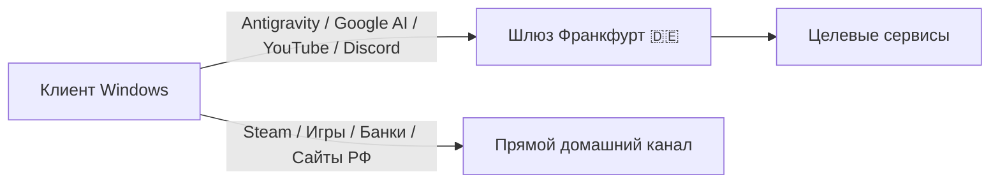

# ProksiFi (antigravity-Proksi_Patch)

**Легковесный клиент маршрутизации и шлюз для Google Antigravity, YouTube и Discord на Windows.**

[**Скачать релиз (Proksi_Patch_Setup.exe)**](https://github.com/root88888tr-creator/antigravity-Proksi_Patch/releases/latest) • [**Telegram-канал**](https://t.me/antigravity_proxy)

---

### Основные возможности

* **Google Antigravity & AI Models (Gemini, Claude Sonnet 4.6, Claude 3.7):** прямое подключение к европейскому шлюзу (Франкфурт 🇩🇪), стабильная работа без региональных блокировок и ошибок генерации.
* **YouTube 4K без буферизации:** автоматическая фильтрация QUIC (UDP 443) с мгновенным переключением на TCP TLS 1.3 в туннеле.
* **Discord & Telegram:** надежная маршрутизация голосовых шлюзов, медиа-серверов и чатов в обход локальных сетевых ограничений.
* **Fail-Safe защита сети при перезагрузке:** интеллектуальный агент трея ожидает инициализацию сетевых интерфейсов до 15 секунд. Если ядро не запущено — системный прокси автоматически деактивируется, гарантируя, что интернет на ПК никогда не пропадёт.
* **Аппаратная привязка без дублирования ключей:** стабильная идентификация устройства (Hardware UUID) сохраняет ваш профиль при любых переустановках и обновлениях.
* **Zero Anti-Cheat Conflicts:** не используются драйверы уровня ядра (`wintun.sys` / `WinDivert.sys`). Античиты игр (BattlEye, EasyAntiCheat, Vanguard, VAC) работают в штатном режиме без перехвата пакетов.
* **Split Tunneling:** локальный трафик (банки, Госуслуги, VK, Яндекс, маркетплейсы и онлайн-игры) идёт напрямую через вашего провайдера на максимальной скорости.
* **Тихие OTA-обновления:** маршруты и списки блокировок синхронизируются в фоне с сервером без необходимости переустанавливать приложение.

---

### Схема маршрутизации

---

### Системные требования

* **ОС:** Windows 10 / Windows 11 (x64)
* **Права:** Права администратора **не требуются** (программа работает в пространстве пользователя)
* **Сеть:** Доступ к портам 443 и 7979

---

### Установка

1. Скачайте актуальный бинарник [`Proksi_Patch_Setup.exe`](https://github.com/root88888tr-creator/antigravity-Proksi_Patch/releases/latest).
2. Запустите файл и выберите необходимые компоненты маршрутизации.
3. Нажмите **«Установить и применить»**.
4. Программа автоматически создаст рабочий профиль в `%APPDATA%\ProksiFi` и разместит иконку управления в системном трее возле часов.

---

### Управление через трей

После установки в панели задач появляется иконка статуса:
* **Зелёный индикатор:** прокси-клиент активен, порт готов к передаче пакетов.
* **Серый индикатор:** системный прокси отключен, весь трафик идёт напрямую через провайдера.
* Меню по правому клику позволяет временно отключить туннелирование, выполнить проверку OTA-обновлений или полностью закрыть приложение.

---

### Ошибки

При ошибке «There was an unexpected issue setting up your account»:
Пройти проверку возраста Google Age Verification.
При ошибке «User location is not supported (400)»:
Не ставить специальные DNS для всей системы (иначе ломаются российские сайты).
Настроить Split DNS через Windows NRPT исключительно на домены:
daily-cloudcode-pa.googleapis.com
generativelanguage.googleapis.com
При ошибке «Agent execution terminated due to error» после обновления:
Закрыть все процессы (antigravity.exe, language_server.exe, agy.exe).
Не накатывать несколько разных анлокеров поверх друг друга.
Если файлы повреждены — выполнить чистую переустановку с очисткой папок:
%LocalAppData%\Programs\Antigravity
%AppData%\Antigravity
%UserProfile%\.antigravity-ide

---

### Удаление

Для удаления приложения достаточно:
1. Выбрать **«Выход»** в контекстном меню трея (сетевой стек Windows автоматически сбросится в исходное состояние).
2. Удалить рабочую директорию: `%APPDATA%\ProksiFi`.

---

  Лицензия MIT. Разработано для сообщества.

